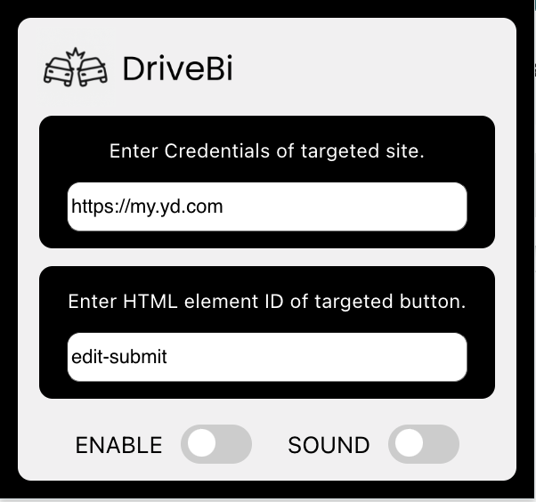

# DriveBi Chrome Extension

A lightweight Chrome extension that automatically clicks a user-defined button on a specified site. Built in under 12 hours for learning purposes.

---

## ✨ Features
- Automatically clicks a button based on an HTML element ID you provide.
- Works only on user-specified sites.
- Optionally plays a sound when the button is clicked.
- Simple enable/disable toggle.
- Settings are saved across sessions.
- No data is collected or shared.

---

## ⚡ How to Use
1️⃣ Click the extension icon to open the settings panel.  
2️⃣ Enter the **Site URL** (e.g. `https://example.com`).  
3️⃣ Enter the **Button ID** (e.g. `submit-button`).  
4️⃣ Toggle **Enable** to turn on auto-clicking.  
5️⃣ (Optional) Toggle **Sound** to play a sound on click.  
6️⃣ Visit the site — the extension will detect and click the button when it becomes enabled.

---

## 🔒 Permissions
- **storage** — To save your settings (site URL, button ID, toggles).
- **scripting** — To inject logic for button detection/clicking.
- **tabs** — To verify the active tab URL.

---

## 🛑 Privacy
This extension does **not** collect, transmit, or share any data. It operates only on pages you configure.

---

## 🛠 Development
This extension was created for my own educational purposes.  
Built using React + Webpack + Chrome Extension APIs.

---

## 📄 License
MIT — Free to use and modify.

